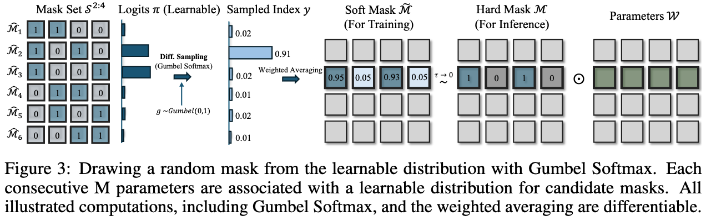
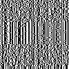
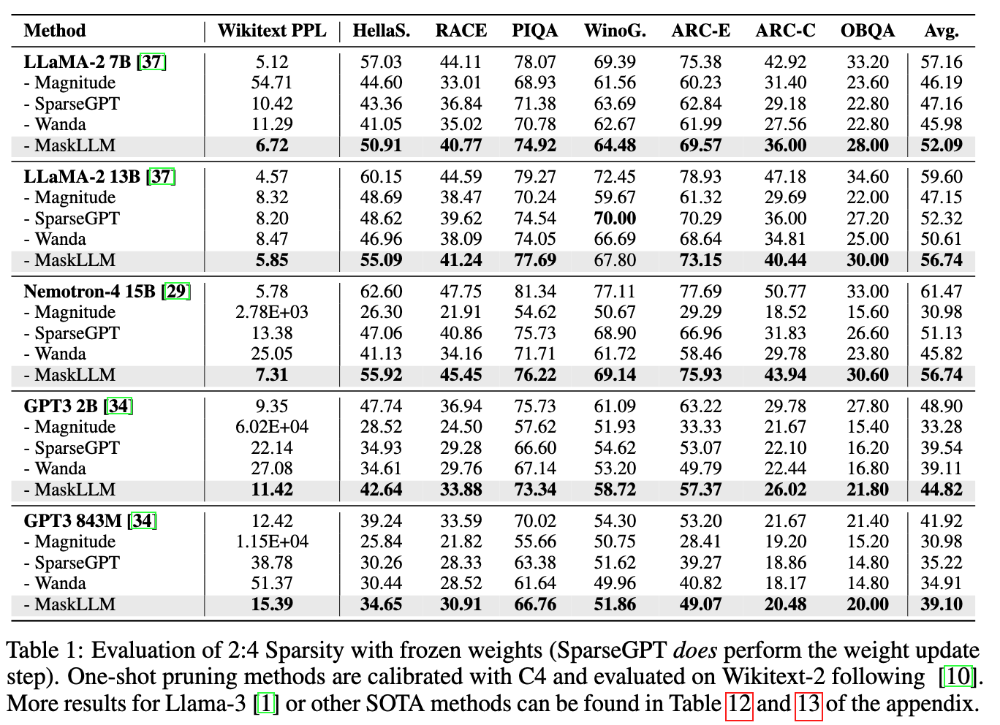

<div align="center">

<h1> MaskLLM </h1>

<h3>MaskLLM: Learnable Semi-structured Sparsity for Large Language Models</h3>

<h4> - NeurIPS 2024 Spotlight - </h4>


[Gongfan Fang](https://fangggf.github.io/), [Hongxu Yin](https://hongxu-yin.github.io/), [Saurav Muralidharan](https://www.sauravm.com/),  [Greg Heinrich](https://research.nvidia.com/person/greg-heinrich) <br>
 [Jeff Pool](https://scholar.google.com/citations?user=DagH37xI9soC&hl=en),  [Jan Kautz](https://jankautz.com/),  [Pavlo Molchanov](https://www.pmolchanov.com/), [Xinchao Wang](https://sites.google.com/site/sitexinchaowang/)  
 
[NVIDIA Research](https://www.nvidia.com/en-us/research/), [National University of Singapore](https://nus.edu.sg/)  

<h1></h1>

📄 [[ArXiv]](https://arxiv.org/abs/2409.17481)  |  🎯 [[Project Page]](https://vainf.github.io/maskllm-project-page/)  |  📎 [[License]](LICENSE)

<figure>
  
 
</div>
 


## 0. What is MaskLLM

This work introduces MaskLLM, a **learnable** pruning method that establishes **Semi-structured (or ``N:M'') Sparsity** in LLMs, aimed at reducing computational overhead during inference. 

## 1. Run MaskLLM with Megatron-LM

The following section provides an example for MaskLLM-LLaMA-2/3 on a single node with 8 GPUs. The LLaMA model will be shard across 8 GPUs with tensor parallelism, taking ~40GB per GPU for end-to-end training. 

### 1.1 Docker Image

Docker is required for Megatron-LM. We use the official PyTorch docker image [``pytorch:24.01-py3``](https://docs.nvidia.com/deeplearning/frameworks/pytorch-release-notes/rel-24-01.html) from NVIDIA NGC as the base image. If you can not use docker, please refer to the [official setup instructions in Megatron-LM](https://github.com/NVIDIA/Megatron-LM?tab=readme-ov-file#setup). Run the following command to download & start the docker container and mount your home directory.
```bash
docker run --gpus all --ipc=host --ulimit memlock=-1 --ulimit stack=67108864 -v $HOME:$HOME -it --rm nvcr.io/nvidia/pytorch:24.01-py3
```

### 1.2 Prepare LLaMA Checkpoints

In the container, we need to download the LLaMA checkpoints and convert them to Megatron format.

#### Download Huggingface Checkpoints

Install basic dependencies.
```bash
pip install transformers accelerate datasets SentencePiece wandb tqdm ninja tensorboardx==2.6 pulp timm einops
```

The following scripts download and save all HF checkpoints at ``./assets/checkpoints``.
```bash
python scripts/tools/download_llama2_7b_hf.py 
python scripts/tools/download_llama2_13b_hf.py
python scripts/tools/download_llama3_8b_hf.py
```

```bash
assets
├── checkpoints
│   ├── llama2_13b_hf
│   ├── llama2_7b_hf
│   └── llama3_8b_hf
```

#### Convert HF to Megatron

Convert the downloaded HF checkpoint to Megatron format, with `tp=8` for tensor parallelism.
```bash
bash scripts/tools/convert_llama2_7b_hf_to_megatron.sh 
bash scripts/tools/convert_llama2_13b_hf_to_megatron.sh 
bash scripts/tools/convert_llama3_8b_hf_to_megatron.sh
```

```bash
assets/
├── checkpoints
│   ├── llama2_13b_hf
│   ├── llama2_13b_megatron_tp8 # <= Megatron format
│   ├── llama2_7b_hf
│   ├── llama2_7b_megatron_tp8
│   ├── llama3_8b_hf
│   └── llama3_8b_megatron_tp8
```

Evaluate the dense model with the arguments `size (7b/8b/13b)`, `tensor parallelism (8)`, and `sparsity (dense or sparse)`.
```bash
bash scripts/ppl/evaluate_llama2_wikitext2.sh assets/checkpoints/llama2_7b_megatron_tp8 7b 8 dense
bash scripts/ppl/evaluate_llama2_wikitext2.sh assets/checkpoints/llama2_13b_megatron_tp8 13b 8 dense
bash scripts/ppl/evaluate_llama3_wikitext2.sh assets/checkpoints/llama3_8b_megatron_tp8 8b 8 dense
```


```bash
# Outputs for LLaMA-2 7B:
validation results on WIKITEXT2 | avg loss: 1.6323E+00 | ppl: 5.1155E+00 | adjusted ppl: 5.1155E+00 | token ratio: 1.0 |

# Outputs for LLaMA-2 13B:
validation results on WIKITEXT2 | avg loss: 1.5202E+00 | ppl: 4.5730E+00 | adjusted ppl: 4.5730E+00 | token ratio: 1.0 |

# Outputs for LLaMA-3 8B:
validation results on WIKITEXT2 | avg loss: 1.7512E+00 | ppl: 5.7615E+00 | adjusted ppl: 5.7615E+00 | token ratio: 1.0 |
```


### 1.3 Pre-tokenize C4 Data for Megatron

Our paper uses a blended internal data for training. For reproducibility, we provide an example of learning masks on a subset of the public [allenai/c4](https://huggingface.co/datasets/allenai/c4) dataset. Corresponding results can be found in Appendix D of our paper. Please see [docs/preprocess_c4.md](docs/preprocess_c4.md) for the instructions.

### 1.4 Generate prior masks 

It is encouraged to start training with a prior mask, either generated by [SparseGPT](https://arxiv.org/abs/2301.00774), [Wanda](https://arxiv.org/abs/2306.11695) or Magnitude Pruning. The following scripts prune an LLaMA-2 7B model with 2:4 patterns. For SparseGPT, weight update is disabled. Add an argument ``--update-weight`` if necessary. More scripts for LLaMA-2 13B and LLaMA-3 8B are available at [scripts/oneshot](scripts/oneshot).
```bash
# <= SparseGPT mask
bash scripts/oneshot/run_llama2_7b_prune_tp8.sh hessian # --update-weight 
# <= Magnitude mask
bash scripts/oneshot/run_llama2_7b_prune_tp8.sh magnitude # --update-weight 
# <= Wanda mask
bash scripts/oneshot/run_llama2_7b_prune_tp8.sh wanda # --update-weight 
```

The pruned Llama model will contain additional `.mask` parameters in sparse linears, such as ``module.language_model.encoder.layers.31.mlp.dense_h_to_4h.mask``. 
```
output/
├── oneshot_pruning
│   ├── checkpoint
│   │   ├── llama2-7b-tp8.sparse.nmprune.sp0.5hessian.ex0 
│   │   └── llama2-7b-tp8.sparse.nmprune.sp0.5magnitude.ex0
│   │   ├── llama2-7b-tp8.sparse.nmprune.sp0.5wanda.ex0
│   ├── llama2-7b-tp8.sparse.nmprune.sp0.5hessian.ex0.log
│   ├── llama2-7b-tp8.sparse.nmprune.sp0.5magnitude.ex0.log
│   └── llama2-7b-tp8.sparse.nmprune.sp0.5wanda.ex0.log
```

To evaluate the pruned model:
```bash
bash scripts/ppl/evaluate_llama2_wikitext2.sh output/oneshot_pruning/checkpoint/llama2-7b-tp8.sparse.nmprune.sp0.5hessian.ex0 7b 8 sparse
```
### 1.5 MaskLLM Training


Mask Sampling          | Visualization
:-------------------------:|:-------------------------:
 | 

By default, the script will load SparseGPT prior. Please modify the path in the script to load other masks. Here 0 means the initial training, and 1 means continue training from the latest checkpoint.

```bash
# Initial training with a prior mask. 
# By default, the script will load output/oneshot_pruning/checkpoint/llama2-7b-tp8.sparse.nmprune.sp0.5hessian.ex0 as the mask prior
bash scripts/learnable_sparsity/llama2_7b_mask_only_tp8_c4.sh 0 

# Pass the argument 1 to continue the training from the latest checkpoint
bash scripts/learnable_sparsity/llama2_7b_mask_only_tp8_c4.sh 1
```

### 1.6 Trim the checkpoint 

For inference, we only need those winner masks with the highest probability. The following command will trim the checkpoint and remove unnecessary components. 
```bash
python tool_trim_learnable_sparsity.py --ckpt_dir output/checkpoints/llama2-7b-tp8-mask-only-c4-singlenode/train_iters_2000/ckpt/iter_0002000 
```
Please modify the content in ``latest_checkpointed_iteration.txt`` as ``release`` for loading. This will set up a clean checkpoint with additional ``.mask`` parameters for each sparse layer.

### 1.7 To evaluate the MaskLLM model:
```bash
# For llama2 7b & 13b
bash scripts/ppl/evaluate_llama2_wikitext2.sh output/checkpoints/llama2-7b-tp8-mask-only-c4-singlenode/train_iters_2000/ckpt/ 7b 8 sparse

bash scripts/ppl/evaluate_llama2_wikitext2.sh output/checkpoints/llama2-13b-tp8-mask-only-c4-singlenode/train_iters_2000/ckpt/ 13b 8 sparse

# For llama3 8b
bash scripts/ppl/evaluate_llama3_wikitext2.sh output/checkpoints/llama3-8b-tp8-mask-only-c4-singlenode/train_iters_2000/ckpt/ 8b 8 sparse
```

### 1.8 Export to HF (Optional)

Please see [docs/export_hf.md](docs/export_hf.md) for instructions on exporting sparse models to Huggingface.

## 2 Key Results



## 3 BibTeX

```bibtex
@article{
   fang2024maskllm,
   title={MaskLLM: Learnable Semi-structured Sparsity for Large Language Models},
   author={Fang, Gongfan and Yin, Hongxu and Muralidharan, Saurav and Heinrich, Greg and Pool, Jeff and Kautz, Jan and Molchanov, Pavlo and Wang, Xinchao },
   journal={Advances in Neural Information Processing Systems},
   year={2024}
}   
```
